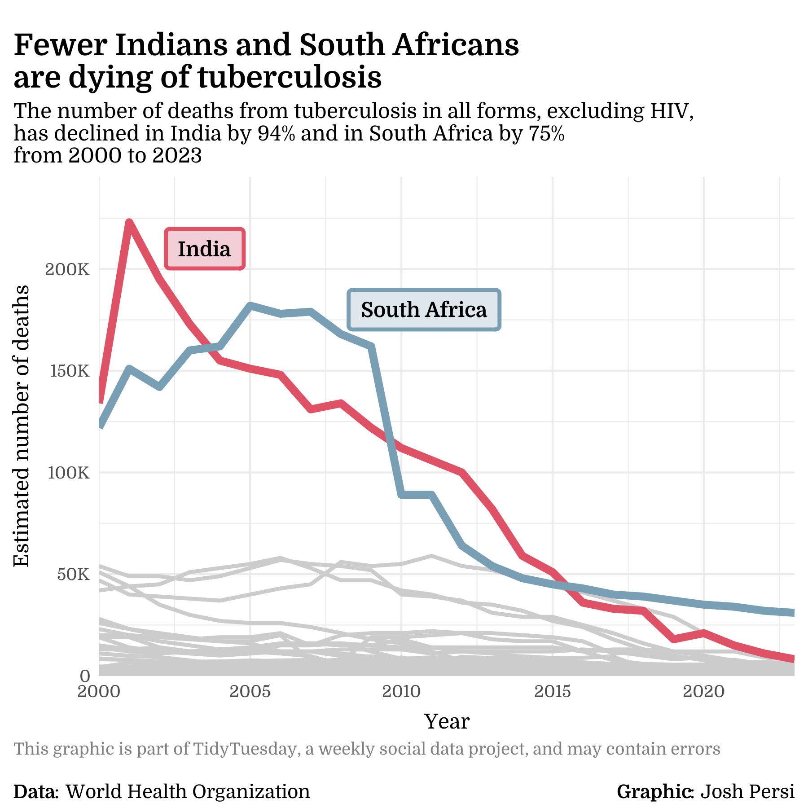
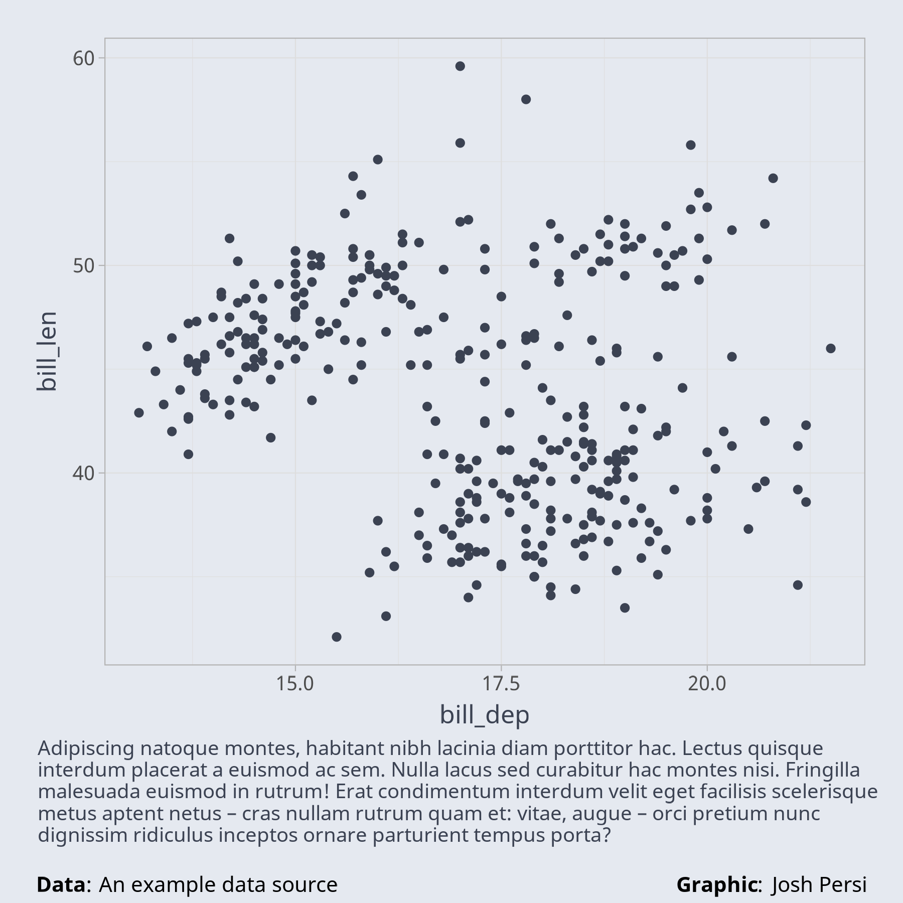

I have been trying to participate in community data-viz events like [TidyTuesday](https://bsky.app/hashtag/TidyTuesday) and the [30DayMapChallenge](https://bsky.app/hashtag/30DayMapchallenge) for years now and recently got the gumption to do so. I've created and shared a handful of graphics so far on [Bluesky](https://bsky.app/profile/joshpersi.bsky.social/post/3m5kwrrq7wk2x) and am having a lot of fun doing it. Here is one of the graphics I'm proud of: 

::: {.card}



:::

In creating this graphic, one of the things I spent a lot of time and effort figuring out is the attributions for the data source and the author. I wanted to use the plot caption (e.g. `labs(caption = "some text")`) to show the caveat about interpretation and, as I learned, there is no way to combine left and right-aligned text. In other words, all text created via the caption in `{ggplot2}` has to have the same alignment. 

For the style I was after, where the source attribution is left-aligned in the bottom-left corner and the author attribution is right-aligned in the bottom-right corner, I had to find another solution. After some searching, I found a workflow using `textGrob()` from the `{grid}` package that does exactly what I want.

With this workflow, exporting graphics is a little different than I was used to. Instead of using `ggsave()` to save the plot object as per the function's arguments, I now use `{ragg}` to specify the graphic's size and resolution, create my plot object as usual, print the plot, and then add the attributions with helper functions that essentially wrap `textGrob()` and `grid.draw()` from the `grid` package. If you want to learn more about these helper functions, you can check them out in [R package of utilities](https://github.com/joshpersi/utilities). The workflow, and its output, is shown below with the key points annotated — all other points are just styling! 

```{.r}
ragg::agg_png("plot.png", width = 6, height = 6, units = "in", res = 300) # <1>

utilities::setup_showtext()

caption_text <- stringr::str_wrap(lorem::ipsum(sentences = 5), 90)

p <- ggplot2::ggplot(penguins, ggplot2::aes(bill_dep, bill_len)) + # <2>
  ggplot2::geom_point(color = utilities::nord_palette["nord0"]) +
  ggplot2::labs(caption = caption_text) +
  utilities::theme_custom()

base::print(p) # <3>

utilities::add_source_attribution(p, "An example data source") # <4>

utilities::add_author_attribution(p) # <4>

grDevices::dev.off() # <5>
```
1. Specify the plot's file name, size, and resolution
2. Create the plot 
3. Print the plot 
4. Add the source and author attributions
5. Turn the graphics device off to save the plot

::: {.card}



:::

