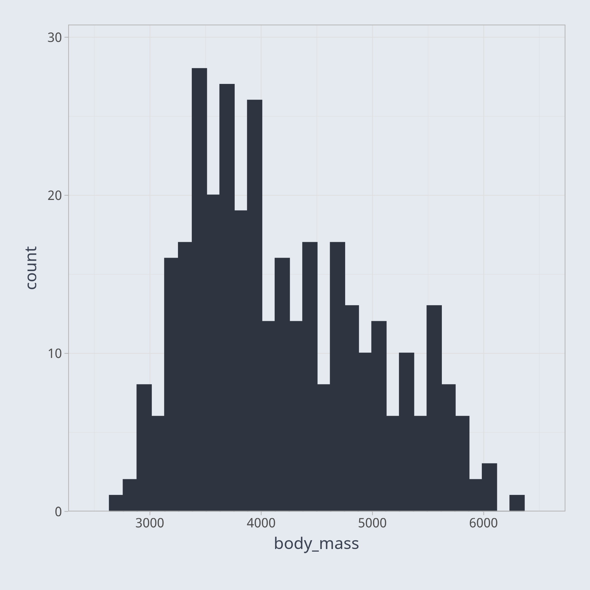

I recently started reading [Think Stats](https://www.oreilly.com/library/view/think-stats-3rd/9781098190248/) by Allen B. Downey and am really enjoying it so far. The third chapter is dedicated to Probability Mass Functions (PMFs), which with their unintuitive names, struck me as something reserved for pure statisticians. As it turns out, PMFs are actually incredibly intuitive and commonplace in data science.

A Probability Mass Function is essentially one simple step beyond a frequency table. If you aren't familiar, a frequency table simply displays each unique value of a dataset alongside counts of how frequently the given value appears in the dataset. To understand this, let's create a frequency table of the body mass of penguins in grams. Here are the first few rows of the frequency table:
 
```{r}
penguins <- penguins |>
  dplyr::filter(!base::is.na(body_mass)) |>
  dplyr::arrange(body_mass)

penguins <- dplyr::count(penguins, body_mass, name = "count")

knitr::kable(utils::head(penguins))
```

<br>

To turn this frequency table into a PMF, all all we need to do is transform these counts, which are also called absolute frequencies, into normalized proportions, which are also called relative frequencies.  
```{r}
penguins <- dplyr::mutate(penguins, proportion = count / base::sum(count))

knitr::kable(utils::head(penguins))
```

<br>

Trying to understand the relative frequencies of various values in your dataset is difficult with a table. We may try to visualize the frequencies as a bar chart, for example. However, if we try to plot a bar for every unique value of body mass, the result, not shown here, is overly cluttered. In this case, a histogram, a special type of bar chart, is a better way to visualize the data.  

```r
ragg::agg_png("plot.png", width = 6, height = 6, units = "in", res = 300) 

utilities::setup_showtext()

p <- ggplot2::ggplot(penguins, ggplot2::aes(body_mass)) +
  ggplot2::geom_histogram(
    fill = utilities::nord_palette["nord0"], 
    color = utilities::nord_palette["nord0"]) +
  utilities::theme_custom() + 
  ggplot2::scale_x_continuous(expand = ggplot2::expansion(mult = 0.1)) + 
  ggplot2::scale_y_continuous(expand = ggplot2::expansion(mult = c(0, 0.1))) +

base::print(p) 

grDevices::dev.off()
```

::: {.card}



:::

